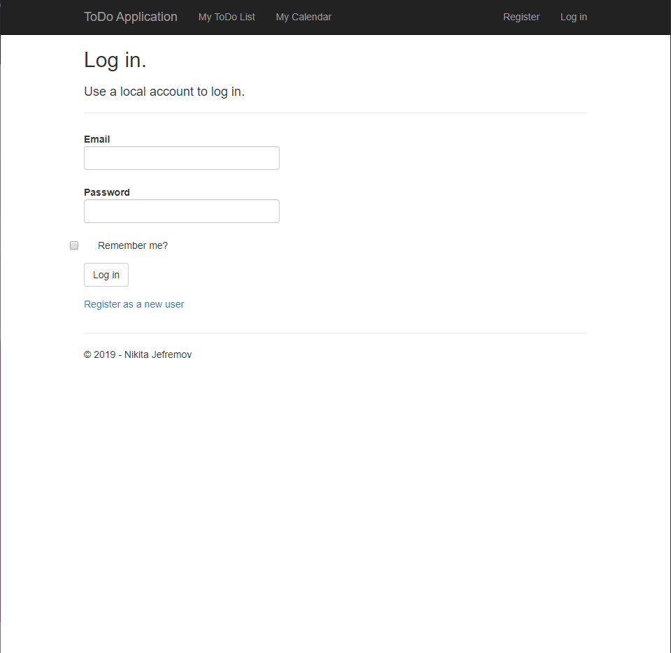
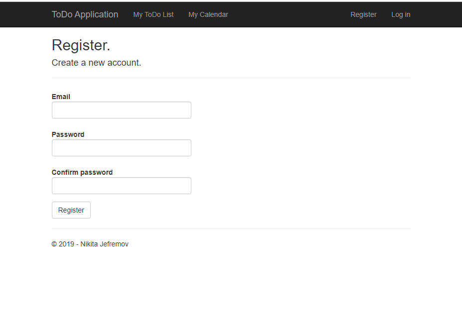
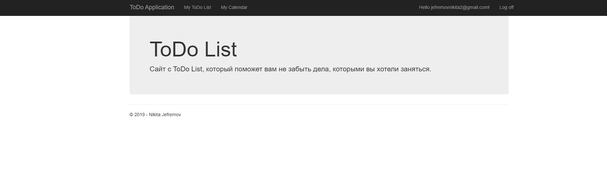
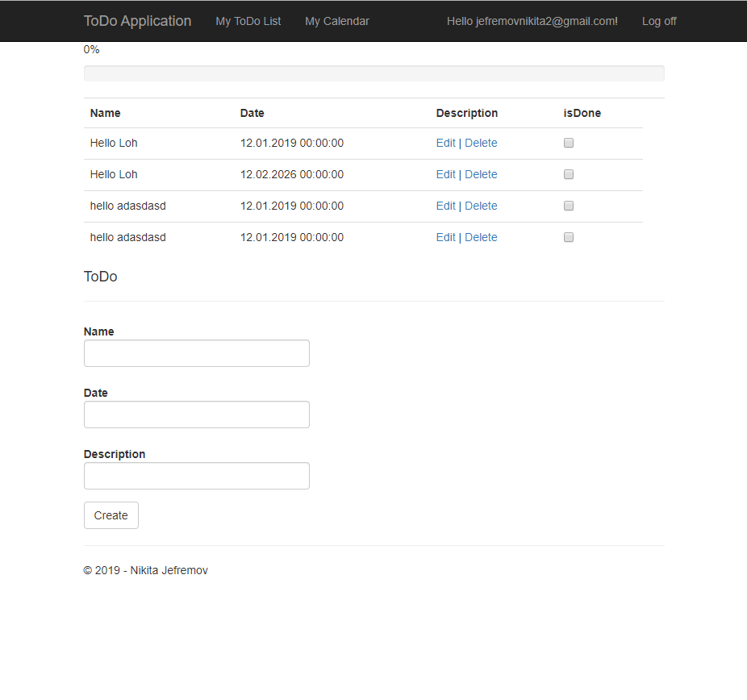
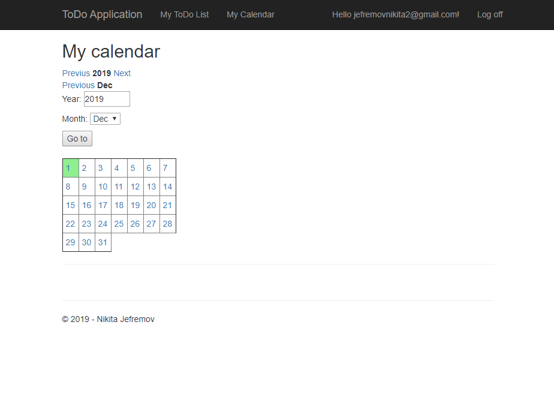
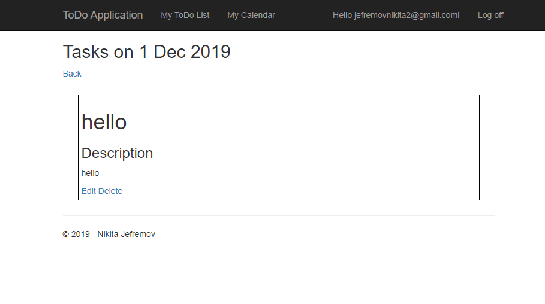

<h1>документация ToDo List</h1>
<h2>Первая часть проекта XML<h2/>
  <h2>Создать веб-страницу с ToDo List, календарем, на странице должны быть данные предмет, время/дата, описание><h3/>
  Этапы:

Создать XML файл, в котором будет 2 или 3 логических диапазона
Файл должен содержать: 
<dl>
  <dt>id</dt>
  <dt>kuupaev</dt>
  <dt>tahtaeg</dt>
  <dt>oppeaine</dt>
  <dt>info</dt>
</dl>

<dl>
<dt>Надо создать свои 3 функции<dt/>
<dd>1.выводить сколько объектов</dd>
<dd>2.поиск по предметам</dd>
<dd>3.добавлять новые данные</dd>
</dl>

<h2>XML Файл</h2>

```
<?xml version="1.0" encoding="utf-8" ?>
<ToDo>
<list>
<name>math</name>
<date>12.02</date>
<description>hi this is math</description>
<period>1 day</period>
</list>
<list>
<name>web</name>
<date>22.12</date>
<description>this is math</description>
<period>4 day</period>
</list>
<list>
<name>programmering</name>
<date>02.03</date>
<description>is math</description>
<period>5 days</period>
</list>
<list>
<name>multimedia</name>
<date>31.12</date>
<description>Hi this is math</description>
<period>10 days</period>
</list>
<list>
<name>russian</name>
<date>08.11</date>
<description>Hi this is math</description>
<period>1 week</period>
</list>
</ToDo>


```


<h2>Поиск по имени</h2>

```

function searchObjectsByName($query){
    global $ToDo;
    $result = array();
    foreach ($ToDo -> list as $list1){
        if (substr(strtolower($list1 -> name), 0, strlen($query))== strtolower($query))
            array_push($result, $list1);
    }
    return $result;
    
    <form action="?" method="post">
            Search: <input type="text" name="searchName" placeholder="Name"/>
            <input type="submit" value="Find" />
        </form>
        <table border="1" class="table table-hover table-dark">
            <tr>
                <th scope="col">name</th>
                <th scope="col">date</th>
                <th scope="col">description</th>
				<th scope="col">period</th>
                
            </tr>
            <?php
            if(!empty($_POST["searchName"])){
            $result = searchObjectsByName($_POST["searchName"]);
            foreach($result as $list1) {
                echo "<tr>";
                echo "<td>".($list1 -> name)."</td>";
                echo "<td>".($list1 -> date)."</td>";
                echo "<td>".($list1 -> description)."</td>";
				echo "<td>".($list1 -> period)."</td>";
                echo "</tr>";
                }
            }
            ?>
      </table>
```

<h2>Поиск по дате</h2>

```

function searchObjectbyDate($query){
    global $ToDo;
    $result = array();
    foreach ($ToDo -> list as $list1){
        if (substr(strtolower($list1 -> date), 0, strlen($query))== strtolower($query))
            array_push($result, $list1);
    }
    return $result;
    
    <form action="?" method="post">
            Search: <input type="text" name="searchDate" placeholder="Name"/>
            <input type="submit" value="Find" />
        </form>
			
			<table border="1" class="table table-hover table-dark">
            <tr>
                <th scope="col">name</th>
                <th scope="col">date</th>
                <th scope="col">description</th>
				<th scope="col">period</th>
                
            </tr>
			<?php
			if(!empty($_POST["searchDate"])){
				$result = searchObjectbyDate($_POST["searchDate"]);
            foreach($result as $list1) {
                echo "<tr>";
                echo "<td>".($list1 -> name)."</td>";
                echo "<td>".($list1 -> date)."</td>";
                echo "<td>".($list1 -> description)."</td>";
				echo "<td>".($list1 -> period)."</td>";
                echo "</tr>";
                }
			}
			
			
			?>
			</table>
```

<h2>Кол-во объектов в таблице</h2>

```

$counter = 0;
<table id="myTable" border="1" class="table table-hover table-dark">
				<tr>
					<th scope="col">name</th>
					<th scope="col">date</th>
					<th scope="col">description</th>
					<th scope="col">period</th>

				</tr>
				
				<?php	  
					foreach($ToDo -> list as $list1){
					$counter++;
					echo "<tr>";
					echo "<td>".($list1 -> name)."</td>";
					echo "<td>".($list1 -> date)."</td>";
					echo "<td>".($list1 -> description)."</td>";
					echo "<td>".($list1 -> period)."</td>";
					echo "<tr>";
					}
					echo "</br>";
					echo "All objects: ".($counter) 
					
				
				?>
			</table>
```

<h2>Вторая часть проекта ASP.NET MVC API/<h2>
  Создать веб-сайт с ToDo List, где будет храниться данные в таблицы. Создать возможность добавлять данные в таблицу, создать календарь.
  На сайте используются 2 роли:
  
  * Гость
  
  * Пользователь
  
  <h2Сценарий</h2>
  
  При заходе на сайт у вас открывается логин, где вы должны залогинитсья для входа на сайт и в дальнейшем использовании календаря
  
  Если на сайте вы не зарегистрированы, то надо зарегистрироваться, для дальнейшего использования.
    

  После логина открывается начальная страница, где вы можете увидеть, что это за сайт.
  
  
 В меню есть кнопка "My ToDo List" она открывается для госта, который может добавить свои действия.
  
  Если вы захотите использовать календарь свой, то надо залогиниться в свой аккаунт.
    
    
  Как вы добавитье свой task в календарь, вы можете просмотреть его, изменить, или уже удалить.
    


  
  


